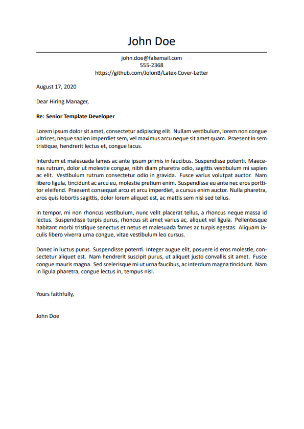

# Latex-Cover-Letter

A template for a cover letter (or similar) in LaTeX.

This template will not work with pdflatex due to the `\setmainfont` command. This can be removed for full compatibility. Otherwise, it is suggested that you use LuaLaTeX or XeLaTeX.

## Commands

| Command | Function | Required |
| --- | --- | --- |
| `\setname` | Sets the name of the document author. | &check; |
| `\settopmatter` | Sets additional information, such as contact details. These should be separated by a new line (`\\`). | |
| `\setgreeting` | Sets the introductory sentence. Defaults to "Dear Hiring Manager," if nothing provided. | |
| `\setregarding` | Set the topic of the letter. | |
| `\setfarewell` | Sets the sign off message. Defaults to "Yours faithfully," if nothing provided. | |

In order to use this template, provide any necessary information through the use of the above commands. The body of the cover letter can be contained within:

```latex
\begin{coverletter}
    % Text goes here
\end{coverletter}
```

A sample file is provided [sample.tex](sample.tex). The output is shown below.

